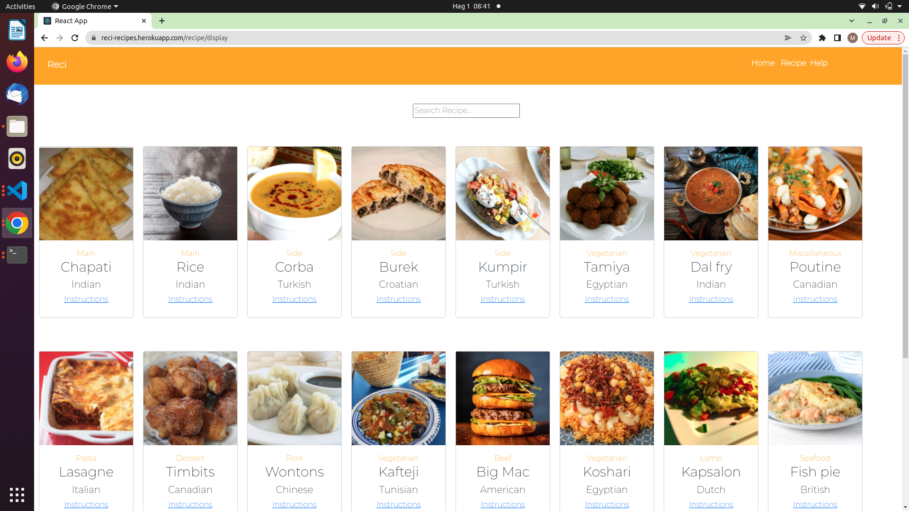

# Reci

### By Miriam Naomi Anyango.

# Screenshot
### Recipes - display page

## Table of Content 

+ [Description](#Description)
 
 + [Features](#Features)

 + [Requirement](#Requirement)

+ [Installation-process](#Installation-Process) 

+ [Live Link](#live-link)

+ [Technology Used](#technology-used)

+ [Reference](#reference)

+ [License](#license)

+ [Authors Info](#authors-info)

## Description

With improvement in Tourism sector and increase in establishment of local hotels, a considerable increase can be seen in the need to know the recipe and the ingredient needed to make different types of cuisines. Getting a platform that can give access for this information can be helpful in helping prepare tailor made cuisines upon request. Many hotels in Kenya have lost customers due to inability of the hotel chefs to prepare ordered food. This has even led to establishment of culture specific restaurants known to offer specific kinds of cuisines that cost time and money to access.

Reci is a web application that can offer recipe and ingredient required to prepare different food. This application is also helpful for those with passion and cooking hobby who wish to try new recipe and cuisines. The application allows search by cuisine as well as dietary requirements.

